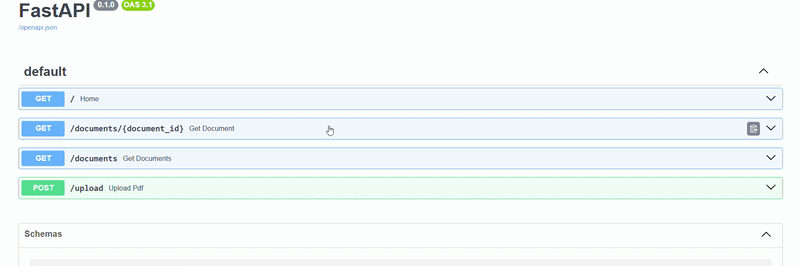

# PDF Summarizer API


[](https://pdf-summarizer-api-production.up.railway.app/docs)

A backend API that accepts text-based PDFs and returns AI-generated summaries — deployed to production on Railway with a live Swagger UI.

---

## Live Deployment

- **API:** https://pdf-summarizer-api-production.up.railway.app
- **Swagger Docs:** https://pdf-summarizer-api-production.up.railway.app/docs

---

## Demo



---

## What This Does

- Client uploads a PDF and gets a `document_id` back instantly
- A background worker extracts the text and sends it to Gemini AI
- The structured result is persisted in PostgreSQL and retrievable at any time

---

## Architecture

```
Client
  │
  ▼
┌─────────────────────────────────┐
│         FastAPI (Port 8000)     │  ← Validates file, extracts text in-memory,
│     Uvicorn ASGI Web Server     │    saves metadata to DB, returns 202 immediately
└────────────┬────────────────────┘
             │ process_pdf.delay(extracted_text, doc_id)
             ▼
┌─────────────────────────────────┐
│       Redis (Task Broker)       │  ← Transports extracted text to the worker
└────────────┬────────────────────┘
             │
             ▼
┌─────────────────────────────────┐
│       Celery Worker             │  ← Calls Gemini 2.5 Flash, parses structured
│  (Background Processing)        │    output, writes result back to PostgreSQL
└────────────┬────────────────────┘
             │
             ▼
┌─────────────────────────────────┐
│       PostgreSQL Database       │  ← Stores document metadata and AI summary
└─────────────────────────────────┘
```

**Why extract text in the API layer, not the worker?**
Railway runs the API and worker as separate containers with no shared filesystem. Passing a file path to the worker would fail — the file doesn't exist on the worker's container. The API extracts text into memory and passes the raw string through Redis, keeping the design stateless and container-safe.

**Why async at all?**
PDF extraction and LLM inference can each take several seconds. A synchronous design would block the API thread entirely. Celery + Redis decouples ingestion from processing, keeping the API responsive and workers independently scalable.

---

## Tech Stack

| Layer | Technology |
|---|---|
| Web Framework | FastAPI |
| Task Queue | Celery |
| Message Broker | Redis 7 |
| Database | PostgreSQL 16 + SQLAlchemy |
| AI Model | Google Gemini 2.5 Flash |
| PDF Parsing | PyPDF2 |
| Containerisation | Docker + Docker Compose |
| Deployment | Railway |

---

## API Endpoints

| Method | Endpoint | Status | Description |
|---|---|---|---|
| `GET` | `/` | 200 | Health check |
| `POST` | `/upload` | 202 | Upload a PDF and queue for processing |
| `GET` | `/documents` | 200 | List all processed documents |
| `GET` | `/documents/{id}` | 200 / 404 | Fetch a document with its AI summary |

### Upload Flow

```
POST /upload
  → validates file (PDF only, max 5MB, must contain extractable text)
  → extracts text in-memory via PyPDF2
  → rejects scanned/image-based PDFs with 422
  → saves Document record to PostgreSQL (status: "processing")
  → dispatches Celery task with extracted text via Redis
  → returns 202 immediately

(background) Celery worker
  → calls Gemini 2.5 Flash with extracted text
  → writes structured result back to PostgreSQL
  → sets status: "completed" (or "failed" on error)
```

### Validation Rules

- PDF files only
- Maximum size: 5 MB
- Must contain extractable text
- Scanned or image-only PDFs are rejected

### Example Request

```bash
curl -X POST https://pdf-summarizer-api-production.up.railway.app/upload \
  -F "file=@your_document.pdf"
```

### Example Upload Response (202)

```json
{
  "message": "PDF uploaded and queued for processing",
  "document_id": 8,
  "status": "processing"
}
```

### Example Document Response (200)

```json
{
  "id": 8,
  "original_filename": "sample_document.pdf",
  "status": "completed",
  "summary": "A concise AI-generated summary of the uploaded document's key points and findings.",
  "created_at": "2026-06-03T02:30:36.488209"
}
```

---

## Local Setup

### Prerequisites

- Docker & Docker Compose
- A Gemini API key — [get one free at Google AI Studio](https://aistudio.google.com/)

### Steps

```bash
# 1. Clone the repo
git clone https://github.com/faraiz88/PDF-Summarizer-API.git
cd PDF-Summarizer-API

# 2. Configure environment variables
cp .env.example .env
# Edit .env and fill in GOOGLE_API_KEY and POSTGRES_PASSWORD

# 3. Start all services (api, worker, redis, postgres)
docker-compose up --build

# 4. Open Swagger UI
open http://localhost:8001/docs
```

---

## Project Structure

```
PDF-Summarizer-API/
├── app/
│   ├── main.py           # FastAPI routes, file validation, upload handling
│   ├── celery_worker.py  # Celery config, process_pdf task, Gemini integration
│   ├── models.py         # SQLAlchemy ORM — Document table
│   ├── schemas.py        # Pydantic response schemas
│   └── database.py       # DB engine, session factory, Base
├── docker-compose.yml    # Multi-service orchestration
├── Dockerfile            # Python image, dependency installation
├── requirements.txt      # Pinned dependencies
├── create_tables.py      # Database initialisation helper
├── .env.example          # Environment variable template
└── assets/
    └── Demo_gif.gif      # Demo animation
```

---

## Author

Mohammed Faraiz — [GitHub](https://github.com/faraiz88)
